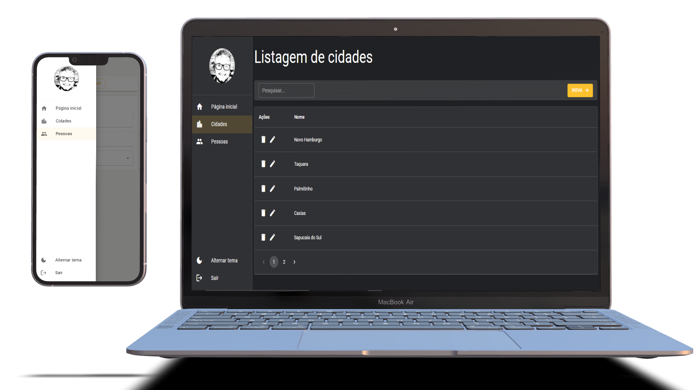

<h4 align="center">
    :computer: App React Material UI - App desenvolvido em um curso do youtube para estudo da biblioteca react e material ui
</h4>

    <a href="#-projeto">Projeto</a>&nbsp;&nbsp;&nbsp;|&nbsp;&nbsp;&nbsp;
    <a href="#rocket-tecnologias">Tecnologias</a>&nbsp;&nbsp;&nbsp;|&nbsp;&nbsp;&nbsp;
    <a href="#user-content-clipboard-instruções">Instruções</a>&nbsp;&nbsp;&nbsp;|&nbsp;&nbsp;&nbsp;

 

## 💻 Projeto

Frontend App em ReactJS. App desenvolvido em um curso do youtube para estudo da biblioteca react e material ui. Útil para um template inicial de projeto frontend com react e material ui

 

## :rocket: Tecnologias

- [Typescript](https://www.typescriptlang.org/)
- [ReactJS](https://pt-br.reactjs.org/)
- [react-router-dom](https://v5.reactrouter.com/web/guides/quick-start)
- [meterial ui](https://mui.com/pt/)
- [axios](https://axios-http.com/)
- [yup](https://www.npmjs.com/package/yup)
- [json-server](https://www.npmjs.com/package/json-server)
---

## :clipboard: Instruções

### INTERFACE - FRONTEND

- Executar `yarn` para instalar todas as dependencias.
- Executar `yarn mock` para rodar os dados mocados em um servidor fake
- Executar `yarn start` para iniciar a interface frontend.
